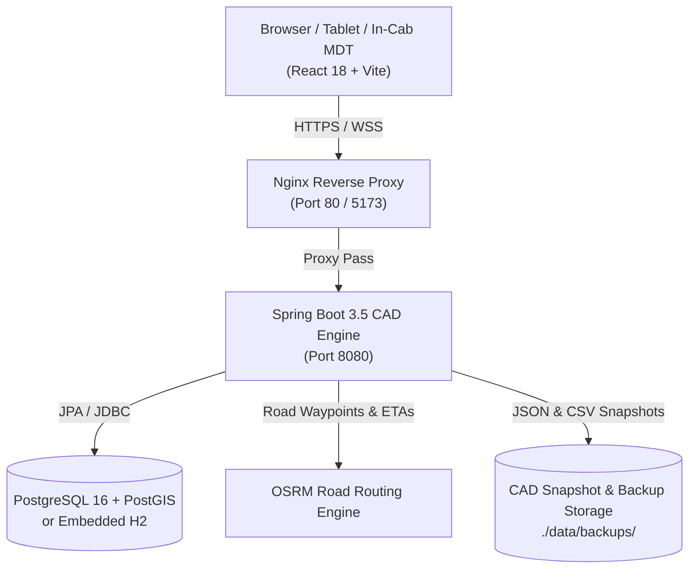

# AEGIS DISPATCH PRO CAD (v2.5)

[](https://github.com/Manish-k07/aegis-dispatch/actions/workflows/deploy.yml)
[](LICENSE)
[-emerald.svg)](SECURITY.md)
[](docker-compose.yml)

Enterprise-grade, full-stack, real-time Computer-Aided Emergency Medical Dispatch (CAD) command & control platform. Engineered for 911/112 public safety answering points, paramedic ambulance fleets, and regional hospital Emergency Departments (ED).

---

## 🚀 Key Capabilities

- **Autonomous Auto-Dispatch Engine**: Real-time multi-factor candidate ranking (OSRM road ETA, clinical capabilities, unit availability, distance, live traffic).
- **Interactive Geospatial Tactical Map**: Leaflet GIS map with animated directional vehicle markers, priority-pulsing incident pins, live route lines, and hospital trauma bay capacity gauges.
- **Paramedic Mobile Data Terminal (MDT)**: In-cab navigation, road HUD, speed/heading telemetry, and one-click voice status updates.
- **Hospital Emergency Department (ED) Console**: Real-time pre-arrival patient vitals monitoring (Heart Rate, Blood Pressure, $SpO_2$, Respiration), trauma bay allocations, and one-click clinical handover.
- **AI Triage & Operations Assistant**: Automated clinical severity triage, intelligent call intake, and voice-assisted dispatching.
- **Full File Persistence & Snapshots**: Automated and manual export of complete operational CAD state into JSON snapshots, CSV tables, and timestamped backups.
- **Multi-Device & Network Ready**: Auto-resolving host architecture enabling instant deployment across local Wi-Fi / LAN laptops, tablets, and in-cab vehicle terminals.

---

## 🔒 Security & Compliance

Aegis Dispatch Pro incorporates defense-in-depth architectural safeguards:
- **HTTP Security Headers**: Enforced `X-Content-Type-Options: nosniff`, `X-Frame-Options: DENY`, `X-XSS-Protection: 1; mode=block`, and restrictive `Content-Security-Policy`.
- **CORS Origin Isolation**: Configurable allowed origins via `app.cors-allowed-origins` / `CORS_ALLOWED_ORIGINS` eliminating wildcard credential exposure.
- **Zero Host Disclosure**: System backup endpoints sanitize server disk paths, ensuring host internal directories are never leaked to API consumers.
- **Exception Shielding**: `GlobalExceptionHandler` intercepts server errors, providing structured JSON payloads while suppressing internal stack traces.
- **Payload & Coordinate Boundary Checks**: Latitude/longitude constraints ($[-90, 90]$, $[-180, 180]$) and string length bounds prevent memory abuse.

📄 Read our complete [Security Policy](SECURITY.md), [Privacy Policy](PRIVACY_POLICY.md), and [Terms & Conditions of Service](TERMS_OF_SERVICE.md).

---

## 🐳 Deploy-Ready Quickstart (Docker Compose)

Deploy the entire production stack (PostGIS Database, Spring Boot Backend, and Nginx + React Frontend) with a single command:

```bash
# 1. Clone the repository
git clone https://github.com/Manish-k07/aegis-dispatch.git
cd aegis-dispatch

# 2. Configure environment variables (optional, defaults provided)
cp .env.example .env

# 3. Launch the containerized production stack
docker compose up -d --build
```

### Access Points:
- **Web Console (Nginx Reverse Proxy):** [http://localhost:5173](http://localhost:5173) (or `http://localhost:80`)
- **Backend API Gateway:** [http://localhost:8080/api/dashboard](http://localhost:8080/api/dashboard)
- **Actuator Health Monitor:** [http://localhost:8080/actuator/health](http://localhost:8080/actuator/health)
- **PostGIS Database:** `localhost:5432` (database: `aegis_dispatch`, user: `aegis`)

---

## ☁️ Google Cloud Run Deployment

The repository includes a production container build in `Dockerfile`, a hardened runtime configuration, and `cloudbuild.yaml`.

### Local production container

```bash
docker build -t aegis-dispatch .
docker run --rm -p 8080:8080 \
  -e CORS_ORIGIN=http://localhost:8080 \
  aegis-dispatch
```

The container serves the React UI and Spring Boot API from the same origin.

### Cloud Run Setup

For a managed cloud deployment, provision a PostgreSQL database (Cloud SQL for PostgreSQL), create an Artifact Registry repository, and create a Secret Manager secret named `aegis-db-password`.

Then configure the substitutions in `cloudbuild.yaml` for your Google Cloud project, Cloud Run region, Cloud SQL instance, database URL, and public Cloud Run origin before running Cloud Build.

Required Google Cloud services:
- Cloud Run
- Artifact Registry
- Cloud Build
- Secret Manager
- Cloud SQL for PostgreSQL

---

## 💻 Local Development Quickstart

### Option A: One-Click Launchers (Windows)
Double-click **`start-all.bat`** in the project root:
- Automatically starts backend on port `8080` (Embedded H2 database in PostgreSQL mode, zero setup required).
- Automatically starts frontend on port `5173`.
- Launches your default web browser to the dashboard.

### Option B: Linux / macOS Launcher
```bash
chmod +x start-all.sh
./start-all.sh
```

### Option C: Manual Start

#### 1. Backend (Spring Boot 3.5 / Java 21)
```bash
cd backend
mvn spring-boot:run
```
*To connect to external PostgreSQL instead of embedded H2:*
```bash
mvn spring-boot:run -Dspring-boot.run.profiles=postgres
```

#### 2. Frontend (React 18 / Vite / TypeScript)
```bash
cd frontend
npm install
npm run dev -- --host 0.0.0.0
```

---

## 🌐 Opening on Other Laptops (LAN / Wi-Fi)

The frontend features dynamic host binding (`frontend/src/config.ts`) and Vite binding (`--host 0.0.0.0`). To open on another laptop on the same local network:

1. Obtain the host machine's Wi-Fi / Ethernet IPv4 address (e.g., `172.20.10.2` or `192.168.1.50`).
2. On any other laptop, tablet, or phone connected to the same Wi-Fi network, navigate to:
   ```
   http://<HOST_IP>:5173
   ```
   *(Ensure Windows Firewall allows inbound TCP traffic on ports 5173 and 8080).*

---

## 🏛️ System Architecture



---

## 📜 Legal & Compliance

- [Privacy Policy (HIPAA / HITECH / GDPR / NDHM)](PRIVACY_POLICY.md)
- [Terms & Conditions of Service](TERMS_OF_SERVICE.md)
- [Security Policy & Vulnerability Disclosure](SECURITY.md)

---

## 🤝 Contributing & License

Pull requests and issues are welcome on [GitHub](https://github.com/Manish-k07/aegis-dispatch). Distributed under the MIT License.
